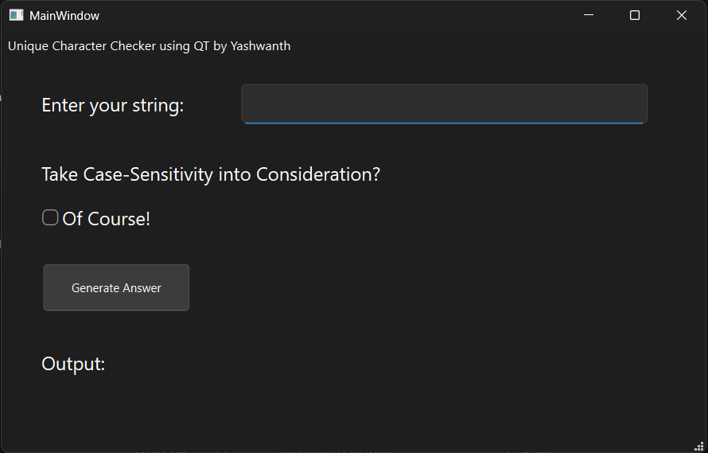

# Qt Unique Characters Checker

A simple Qt Widgets-based GUI application that checks whether an input string contains **all unique characters**, with optional **case sensitivity**.

## Features

- Input a string using a GUI
- Toggle **Case Sensitivity** (treat `A` and `a` as the same or different)
- Instant feedback on whether characters are unique
- Displays list of unique characters if valid
- Alerts for invalid or empty input

## Screenshot

## How to Run

Go to the path: "Alstom_Interview\Qt_Gui_Simulation\ExportApplication\"

Run the following application: UniqueCharChecker.exe
